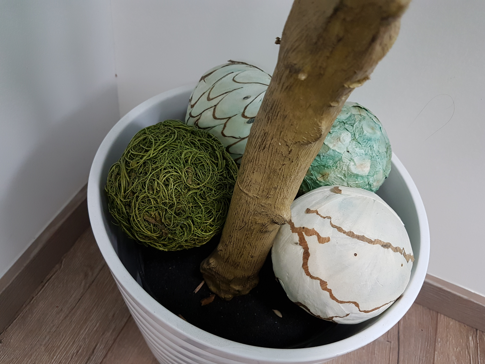
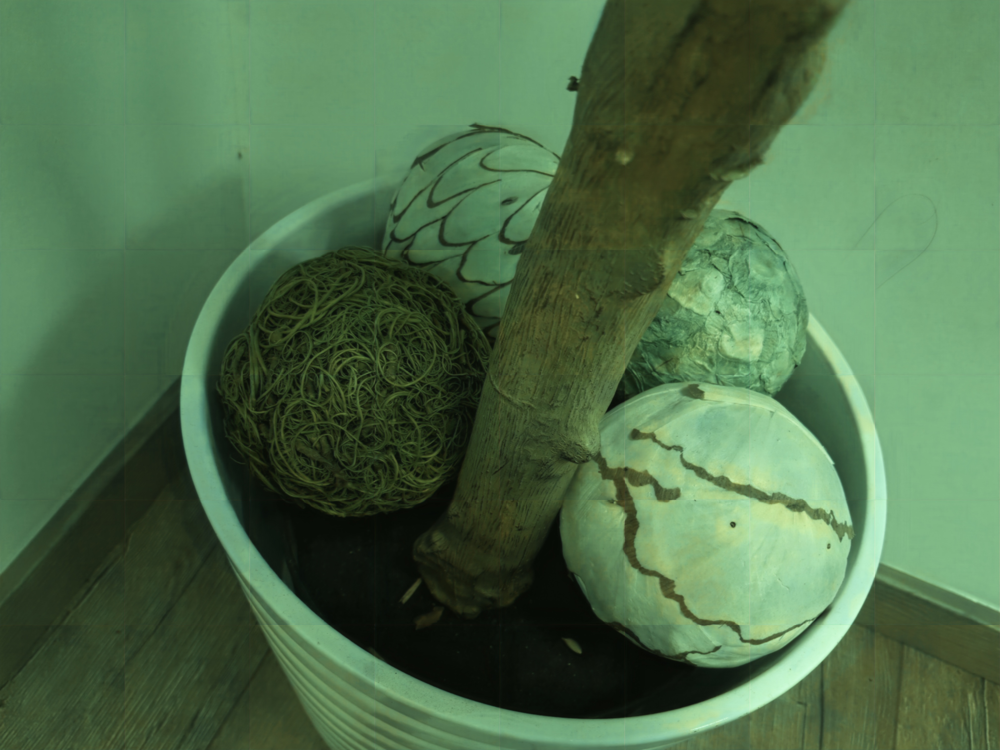
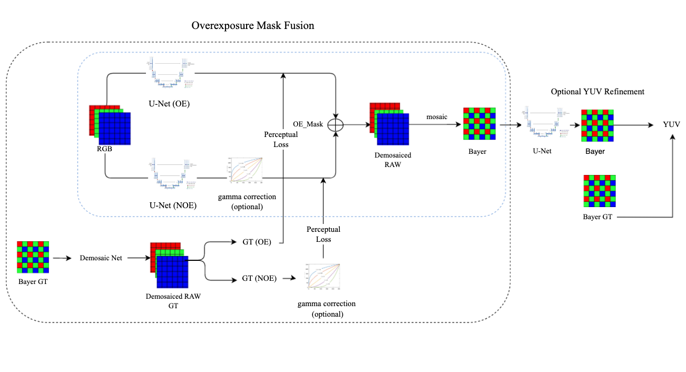

## Overexposure Mask Fusion: Generalizable Reverse ISP Multi-Step Refinement 


<p float="center">
  
   
</p>

#### 1. Overview 

This is the official repository providing the inference code for RGB-to-RAW mapping for ECCV 2022 and AIM Workshop 2022. The provided pre-trained models can be used to run inference for the Samsung S7 dataset. The repository also contains a simulator that can be run on linux to unprocess RGB images. 

<br/>

#### 2. Prerequisites

- Python: numpy, imageio and other packages listed in requirements.txt 
- [PyTorch + TorchVision](https://pytorch.org/) libraries
- Nvidia GPU

<br/>

#### 3. First steps

- Download the validation images in `test_rgb/` folder. 
- Run the test.py script and the output RAW data will be stored in `results/` folder. 

*How to run reverseISP simulator (only works on linux):*

1. put input in the test_rgb folder
2. place the trained models intp the trained_models folder
3. open a terminal in current dir, then run './test' (please note that it may take a couple minutes to load the dependencies, if you let it running on the terminal then it will eventually run (ignore warnings) 
4. output will be saved in the submission folder


<br/>


#### 4. Overexposure Fusion Network Architecture 

<br/>



<br/>

 The general structure of pipeline consists of unprocessing the input RGB image to its original demosaiced RAW, after which a simple mosaic is performed to recover to bayer. For training, the pipeline involves generating new groundtruth RGB images by passing the groundtruth bayer through a pretrained Demosaic Net in order to reconstruct the demosaiced RAW. Notably, unlike methodologies that map directly from RGB to bayer, the proposed pipeline maps initially from RGB to demosaiced RAW, which enables the use of perceptual loss functions.

Inference involves passing RGB input into U-Net (OE) and U-Net (NOE), after which the two images are simply blended together with the use of the overexposure mask. Inference is then completed by taking the demosaiced RAW output and mosaicing to convert to bayer

<br/>

#### 5. License

The code is released for academic research use only.

<br/>

#### 6. Any further questions?

```
Please contact Jinha Kim (jinhakim@mit.edu) for more information
```


